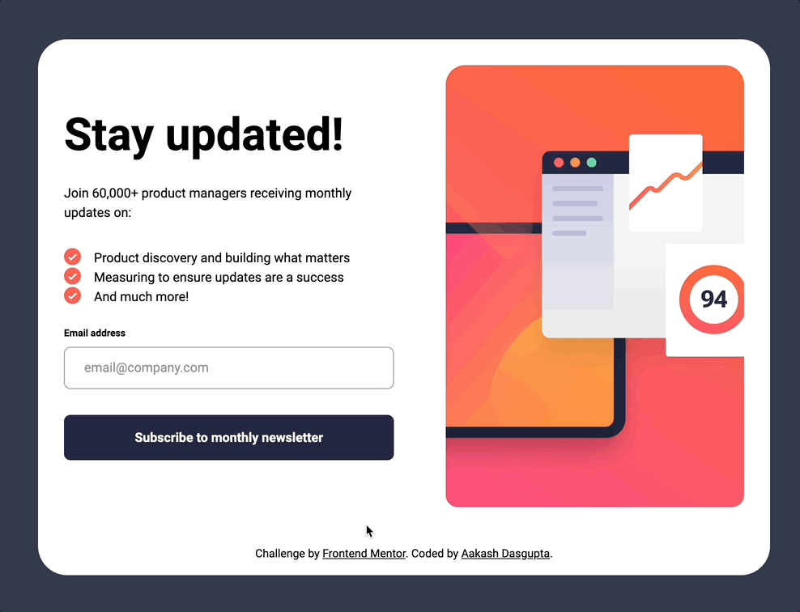

# Frontend Mentor - Newsletter sign-up form with success message solution

This is a solution to the [Newsletter sign-up form with success message challenge on Frontend Mentor](https://www.frontendmentor.io/challenges/newsletter-signup-form-with-success-message-3FC1AZbNrv).

## Table of contents

- [Overview](#overview)
  - [The challenge](#the-challenge)
  - [Screenshot](#screenshot)
  - [Links](#links)
- [My process](#my-process)
  - [Built with](#built-with)
  - [What I learned](#what-i-learned)
  - [Useful resources](#useful-resources)
- [Author](#author)

## Overview

### The challenge

Users should be able to:

- Add their email and submit the form
- See a success message with their email after successfully submitting the form
- See form validation messages if:
  - The field is left empty
  - The email address is not formatted correctly
- View the optimal layout for the interface depending on their device's screen size
- See hover and focus states for all interactive elements on the page

### Screenshot

| Feature  | Preview |
|----------|---------|
| Flow |  |

### Links

- Solution URL: [Link](https://github.com/a-d14/newsletter-sign-up-frontend-mentor)
- Live Site URL: [Link](https://a-d14.github.io/newsletter-sign-up-frontend-mentor)

## My process

### Built with

- Semantic HTML5 markup
- CSS custom properties
- Flexbox
- Mobile-first workflow
- Vanilla JavaScript

### What I learned
- In this projects I explored various ways of form validation using JS. I thought about using regex but went with using the ```validity``` property of form elements.

### Useful resources

- [MDN](https://developer.mozilla.org/en-US/docs/Learn_web_development/Extensions/Forms/Form_validation) - The definitive guide to building forms with validation using JS.

## Author
- Frontend Mentor - [@a-d14](https://www.frontendmentor.io/profile/a-d14)
